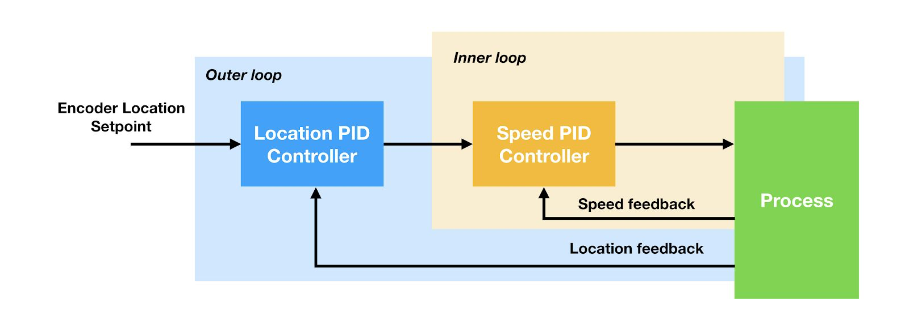

# Cascade PID Control

This is a STM32 project demonstrating the effect of cascade PID on lifting mechanism. 

## Challenges

There are two challenges in this project:

1. The mechanism must be able to lift up objects within its theoretical limit
2. The mechanism must not overshoot, or else it will cause damage to itself

Using just one PID (either location PID or speed PID) would not work because:

1. For location PID, it will not output enough power to lift up objects that it should be able to
2. For speed PID, it will overshoot and hurt itself

## Solution

The challenges could be solved with two loops of PID. 

As shown in the below diagram, the location PID loop is attached outside of the speed PID loop. With two PID loops working with each other, we can specify the angle the mechanism should be at when it is in its lift up position. The mechanism on its own would automatically output more power to the motors if the target turn has not been satisfied. If the power is too high that the robot exceeds the target turn, negative power will be calculated to direct the robot back to the target. Since such automation corrects itself based on the actual degrees the robot has turned regardless of the object's weight, the robot would perform a perfect lift up even when objects weight differently.

